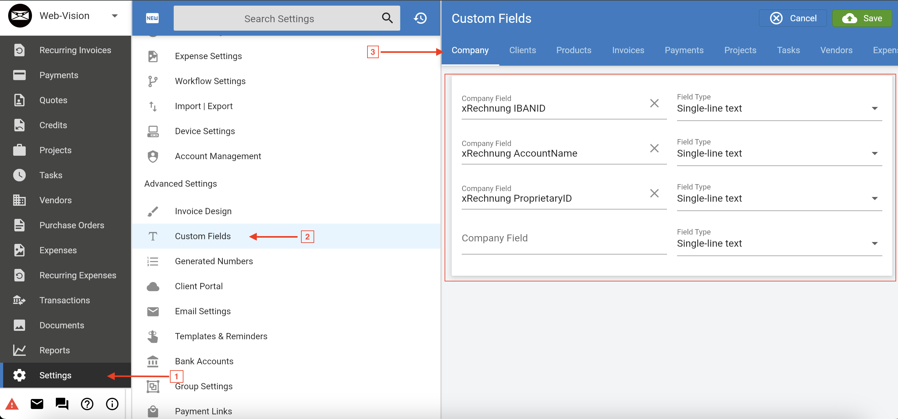
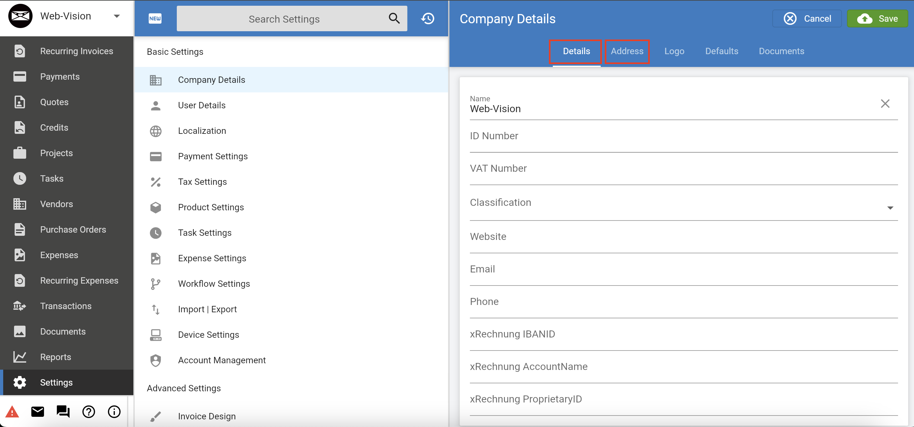
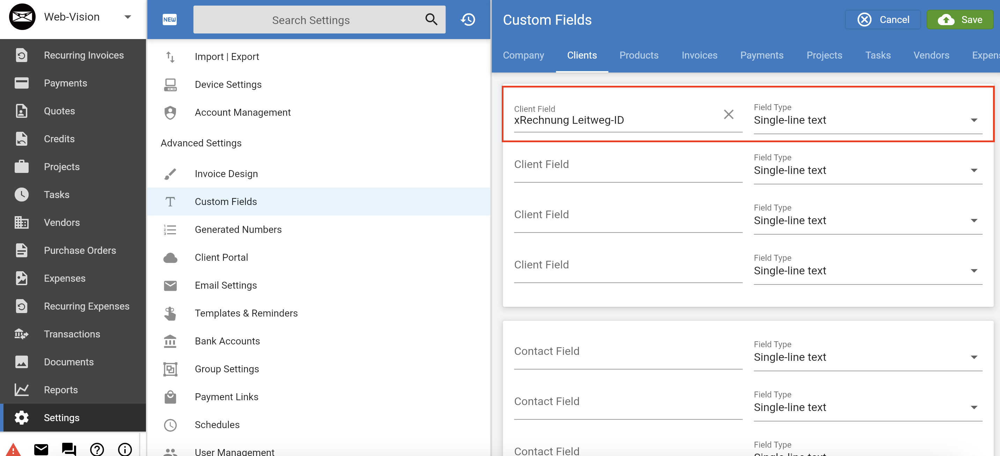
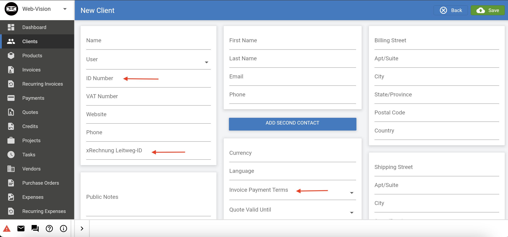
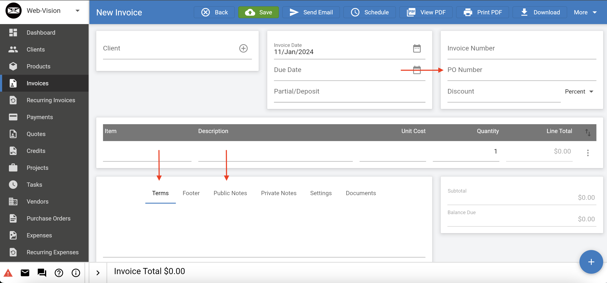

# Invoice Ninja xRechnung

Invoice Ninja enhances its user experience by providing a seamless standard UBL export feature. For the specific requirements of Governmental invoices, we have gone a step further by incorporating support for xRechnung. 

This extension is particularly valuable as xRechnung is built upon the UBL foundation, ensuring compatibility and compliance with the invoicing standards. By offering this extended support, Invoice Ninja caters to the diverse needs of users, allowing them to effortlessly generate and manage invoices, whether for standard use or in alignment with governmental invoicing regulations. This commitment to flexibility and adaptability reinforces Invoice Ninja's position as a comprehensive invoicing solution suitable for various business contexts.

## Package installation guide

Installing this package will enable your system to seamlessly generate UBL exports and efficiently handle xRechnung formats.

We highly recommend gathering all the below information, before starting the installation.

## Prerequisites
Before installing the package, you need to create the fields below from the **Custom Field** setting. And make sure to fill the fields when creating a new Client and for Customer update the Customer Details.

### Company Details:
To support xRechnung invoice create a custom fields, following the steps mentioned outlined below:

**Note:**  We recommend to name it as **xRechnung IBANID** , **xRechnung AccountName**, **xRechnung ProprietaryID**.

- Navigate to: **Settings** > **Advance Settings** > **Custome Fields** > **Company**

    

- Click: **Save** button

- Make sure to fill out all the field under **Detail** and **Address** tab in your company setup, as they will be utilized for xRechnung purposes. Navigate to **Setting** > **Company Details** 

    

### Client Details:
To create custom fields for client details, please follow the steps outlined below:

**Note:**  We recommend to name it as **xRechnung Leitweg-ID**.

- Navigate to: **Settings** > **Advance Settings** > **Custome Fields** > **Client**

    

- Click: **Save** button

- Navigate to **Clients**, click on **Create** button

- Fill out the basic fields and be sure to update the highlighted ones, as they will be utilized for xRechnung-related purposes. Ensure that you update them accordingly.

    

### Invoice Details:

Ensure that you added all the highlighted fields in the Invoice. Navigate to **Invoices** > **New Invoice**.

    

## Installation
In the root directory run the following commands using the command line

`composer update webvision/ninja-xrechnung --no-cache`

`php artisan cache:clear && php artisan config:clear && php artisan route:clear`

Make sure to register `Webvision\NinjaZugferd\Providers\RouteServiceProvider::class` in the providers section of the root config/app.php file.